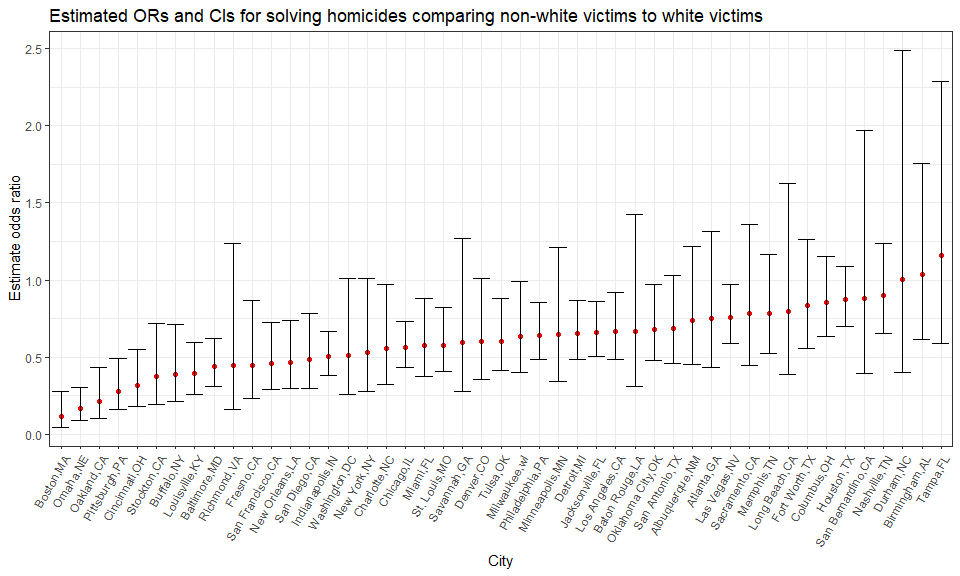

p8105\_hw6\_jy2944
================
Jie Yu
11/25/2018

-   [Problem 1](#problem-1)
    -   [Import and tidy data](#import-and-tidy-data)
    -   [Fit a logistic regression for one city](#fit-a-logistic-regression-for-one-city)
    -   [Fit logistic regression for each of the cities](#fit-logistic-regression-for-each-of-the-cities)
    -   [Plot showing ORs and CIs for each city](#plot-showing-ors-and-cis-for-each-city)

Problem 1
=========

### Import and tidy data

Read data through a [GitHub repository](https://github.com/washingtonpost/data-homicides). Create a `city_state` variable (e.g. “Baltimore, MD”), and a binary variable indicating whether the homicide is solved. Omit cities Dallas, TX; Phoenix, AZ; and Kansas City, MO – these don’t report victim race. Also omit Tulsa, AL – this is a data entry mistake. Modifiy `victim_race` to have categories `white` and `non-white`, with `white` as the reference category. Be sure that `victim_age` is numeric.

``` r
# Read data through a Github repo
homicide_data = read_csv("https://raw.githubusercontent.com/washingtonpost/data-homicides/master/homicide-data.csv") %>% 
  mutate(
    # Create a `city_state` variable (e.g. “Baltimore, MD”)
    city_state = str_c(city, ",", state),
    # Create a binary variable indicating whether the homicide is solved: 1 - solved; 0 - unsolved
    resolved = as.numeric(disposition == "Closed by arrest")
    ) %>% 
  # Omit some cities
  filter(!city_state %in% c("Dallas,TX","Phoenix,AZ", "Kansas City,MO", "Tulsa,AL")) %>%
  mutate(
    # Modifiy `victim_race` to have categories `white` and `non-white`, with `white` as the reference
    victim_race = fct_relevel(ifelse(victim_race == "White", "white", "non-white"), "white"),
    # Be sure that `victim_age` is numeric
    victim_age = as.numeric(victim_age)
    )
```

### Fit a logistic regression for one city

For the city of Baltimore, MD, use the `glm` function to fit a logistic regression with resolved vs unresolved as the outcome and victim age, sex and race (as just defined) as predictors. Save the output of `glm` as an R object; apply the `broom::tidy` to this object; and obtain the estimate and CI of the **adjusted odds ratio** for solving homicides comparing non-white victims to white victims keeping all other variables fixed.

``` r
balti_logistic = homicide_data %>% 
  # filter the city
  filter(city_state == "Baltimore,MD") %>% 
  # Fit a logistic regression: `resolved` as outcome
  glm(resolved ~ victim_age + victim_sex + victim_race, data = ., family = binomial()) 

balti_logistic %>% 
  broom::tidy() %>% 
  # Obtain odds ratio and its CI
  # Note: logistic model estimates are log odds ratios, so we need to tranform them back
  mutate(
    OR = exp(estimate),
    conf.lower = exp(estimate - std.error * 1.96),
    conf.upper = exp(estimate + std.error * 1.96)
    ) %>%
  select(term, OR, conf.lower, conf.upper, p.value) %>% 
  knitr::kable(digits = 3)
```

| term                  |     OR|  conf.lower|  conf.upper|  p.value|
|:----------------------|------:|-----------:|-----------:|--------:|
| (Intercept)           |  3.274|       2.067|       5.186|    0.000|
| victim\_age           |  0.993|       0.987|       0.999|    0.032|
| victim\_sexMale       |  0.412|       0.315|       0.537|    0.000|
| victim\_racenon-white |  0.441|       0.313|       0.620|    0.000|

The odds ratio for solving solving homicides comparing non-white victims to white victims is 0.441 and the CI is (0.312, 0.620) with 95% confidence interval. It means that homicides in which the victim was non-white were substantially less likely to be resolved than those in which the victim was white (OR = 0.441 &lt; 1, p-value &lt; 0.001). The non-white victims had 0.441 times the odds of having their cases being resolved compared to the white victims. The true odd ratio is between 0.312 and 0.620.

### Fit logistic regression for each of the cities

Now run `glm` for each of the cities in the dataset, and extract the adjusted odds ratio and CI for solving homicides comparing non-white victims to white victims. Do this within a “tidy” pipeline, making use of `purrr::map`, list columns, and `unnest` as necessary to create a dataframe with estimated ORs and CIs for each city.

``` r
# Contruct a function `or_and_ci` to calculate OR and CI using `glm` results
or_and_ci = function(df){
    glm = glm(resolved ~ victim_age + victim_sex + victim_race, data = df, family = binomial())
    
    logistic_tidy = glm %>% 
      broom::tidy() %>% 
      mutate(
        OR = exp(estimate),
        conf.lower = exp(estimate - std.error * 1.96),
        conf.upper = exp(estimate + std.error * 1.96)
        ) %>%
      select(term, OR, conf.lower, conf.upper, p.value) %>% 
      # filter the term of non-white victims
      filter(term == "victim_racenon-white") %>% 
      select(-term)
    }

city_logistic = homicide_data %>% 
  # nest the data by each city
  group_by(city_state) %>% 
  nest() %>% 
  # Apply the function `or_and_ci` to each city
  mutate(or_and_ci = map(.x = data, ~or_and_ci(.x))) %>% 
  select(-data) %>% 
  unnest()

city_logistic
## # A tibble: 47 x 5
##    city_state        OR conf.lower conf.upper    p.value
##    <chr>          <dbl>      <dbl>      <dbl>      <dbl>
##  1 Albuquerque,NM 0.741     0.451       1.22  0.238     
##  2 Atlanta,GA     0.753     0.432       1.31  0.317     
##  3 Baltimore,MD   0.441     0.313       0.620 0.00000268
##  4 Baton Rouge,LA 0.668     0.313       1.43  0.296     
##  5 Birmingham,AL  1.04      0.615       1.76  0.886     
##  6 Boston,MA      0.115     0.0472      0.278 0.00000172
##  7 Buffalo,NY     0.390     0.213       0.715 0.00231   
##  8 Charlotte,NC   0.558     0.321       0.969 0.0383    
##  9 Chicago,IL     0.562     0.431       0.733 0.0000207 
## 10 Cincinnati,OH  0.318     0.184       0.551 0.0000428 
## # ... with 37 more rows
```

### Plot showing ORs and CIs for each city

``` r
city_logistic %>% 
  # # organize cities according to estimated OR
  mutate(city_state = forcats::fct_reorder(city_state, OR)) %>% 
  # make the plot
  ggplot(aes(x = city_state, y = OR)) + 
  # points represent the ORs for each city
  geom_point(color = "red") + 
  # geom_errorbar(): add error bars based on the upper and lower limits
  geom_errorbar(aes(x = city_state, ymin = conf.lower, ymax = conf.upper)) + 
  labs(
    title = "Estimated ORs and CIs for solving homicides comparing non-white victims to white victims", 
    x = "City", 
    y = "Estimate odds ratio") +
  theme(axis.text.x = element_text(angle = 60, hjust = 1))
```



Estimated odds ratio and its confidence interval for solving homices comparing non-white victioms to white victims varies across cities in US. Most of the cities have estimated odds ratios lower than 1, meaning that homicides in which the victim is non-white are less likely to be resolved than those in which the victim is white in US. Boston, MA has the lowest estimated odds ratio while Tampa, FL has the highest estimated odds ratio.
