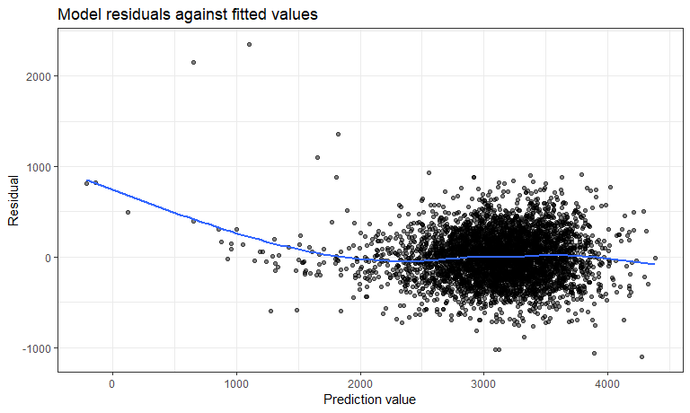
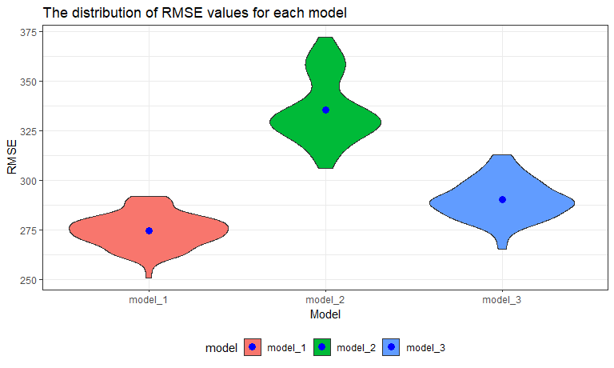

p8105\_hw6\_jy2944
================
Jie Yu
11/25/2018

-   [Problem 1](#problem-1)
    -   [Import and tidy data](#import-and-tidy-data)
    -   [Fit a logistic regression for one city](#fit-a-logistic-regression-for-one-city)
    -   [Fit logistic regression for each of the cities](#fit-logistic-regression-for-each-of-the-cities)
    -   [Plot showing ORs and CIs for each city](#plot-showing-ors-and-cis-for-each-city)
-   [Problem 2](#problem-2)
    -   [Import and tidy data](#import-and-tidy-data-1)
    -   [Propose a regression model for birthweight](#propose-a-regression-model-for-birthweight)
    -   [Plot of model residuals against fitted values](#plot-of-model-residuals-against-fitted-values)
    -   [Compare models](#compare-models)

Problem 1
=========

### Import and tidy data

Read data through a [GitHub repository](https://github.com/washingtonpost/data-homicides). Create a `city_state` variable (e.g. “Baltimore, MD”), and a binary variable indicating whether the homicide is solved. Omit cities Dallas, TX; Phoenix, AZ; and Kansas City, MO – these don’t report victim race. Also omit Tulsa, AL – this is a data entry mistake. Modifiy `victim_race` to have categories `white` and `non-white`, with `white` as the reference category. Be sure that `victim_age` is numeric.

``` r
# Read data through a Github repo
homicide_data = read_csv("https://raw.githubusercontent.com/washingtonpost/data-homicides/master/homicide-data.csv") %>% 
  mutate(
    # Create a `city_state` variable (e.g. “Baltimore, MD”)
    city_state = str_c(city, ",", state),
    # Create a binary variable indicating whether the homicide is solved: 1 - solved; 0 - unsolved
    resolved = as.numeric(disposition == "Closed by arrest")
    ) %>% 
  # Omit some cities
  filter(!city_state %in% c("Dallas,TX","Phoenix,AZ", "Kansas City,MO", "Tulsa,AL")) %>%
  mutate(
    # Modifiy `victim_race` to have categories `white` and `non-white`, with `white` as the reference
    victim_race = fct_relevel(ifelse(victim_race == "White", "white", "non-white"), "white"),
    # Be sure that `victim_age` is numeric
    victim_age = as.numeric(victim_age)
    )

str(homicide_data)
## Classes 'tbl_df', 'tbl' and 'data.frame':    48507 obs. of  14 variables:
##  $ uid          : chr  "Alb-000001" "Alb-000002" "Alb-000003" "Alb-000004" ...
##  $ reported_date: int  20100504 20100216 20100601 20100101 20100102 20100126 20100127 20100127 20100130 20100210 ...
##  $ victim_last  : chr  "GARCIA" "MONTOYA" "SATTERFIELD" "MENDIOLA" ...
##  $ victim_first : chr  "JUAN" "CAMERON" "VIVIANA" "CARLOS" ...
##  $ victim_race  : Factor w/ 2 levels "white","non-white": 2 2 1 2 1 1 2 2 1 2 ...
##  $ victim_age   : num  78 17 15 32 72 91 52 52 56 43 ...
##  $ victim_sex   : chr  "Male" "Male" "Female" "Male" ...
##  $ city         : chr  "Albuquerque" "Albuquerque" "Albuquerque" "Albuquerque" ...
##  $ state        : chr  "NM" "NM" "NM" "NM" ...
##  $ lat          : num  35.1 35.1 35.1 35.1 35.1 ...
##  $ lon          : num  -107 -107 -107 -107 -107 ...
##  $ disposition  : chr  "Closed without arrest" "Closed by arrest" "Closed without arrest" "Closed by arrest" ...
##  $ city_state   : chr  "Albuquerque,NM" "Albuquerque,NM" "Albuquerque,NM" "Albuquerque,NM" ...
##  $ resolved     : num  0 1 0 1 0 0 1 1 0 0 ...
```

### Fit a logistic regression for one city

For the city of Baltimore, MD, use the `glm` function to fit a logistic regression with resolved vs unresolved as the outcome and victim age, sex and race (as just defined) as predictors. Save the output of `glm` as an R object; apply the `broom::tidy` to this object; and obtain the estimate and CI of the **adjusted odds ratio** for solving homicides comparing non-white victims to white victims keeping all other variables fixed.

``` r
balti_logistic = homicide_data %>% 
  # filter the city
  filter(city_state == "Baltimore,MD") %>% 
  # Fit a logistic regression: `resolved` as outcome
  glm(resolved ~ victim_age + victim_sex + victim_race, data = ., family = binomial()) 

balti_logistic %>% 
  broom::tidy() %>% 
  # Obtain odds ratio and its CI
  # Note: logistic model estimates are log odds ratios, so we need to tranform them back
  mutate(
    OR = exp(estimate),
    conf.lower = exp(estimate - std.error * 1.96),
    conf.upper = exp(estimate + std.error * 1.96)
    ) %>%
  select(term, OR, conf.lower, conf.upper, p.value) %>% 
  knitr::kable(digits = 3)
```

| term                  |     OR|  conf.lower|  conf.upper|  p.value|
|:----------------------|------:|-----------:|-----------:|--------:|
| (Intercept)           |  3.274|       2.067|       5.186|    0.000|
| victim\_age           |  0.993|       0.987|       0.999|    0.032|
| victim\_sexMale       |  0.412|       0.315|       0.537|    0.000|
| victim\_racenon-white |  0.441|       0.313|       0.620|    0.000|

The odds ratio for solving homicides comparing non-white victims to white victims is 0.441 and the 95% confidence interval is (0.312, 0.620). It means that homicides in which the victim was non-white were substantially less likely to be resolved than those in which the victim was white (OR = 0.441 &lt; 1, p-value &lt; 0.001). The non-white victims had 0.441 times the odds of having their cases being resolved compared to the white victims. The true odd ratio is between 0.312 and 0.620.

### Fit logistic regression for each of the cities

Now run `glm` for each of the cities in the dataset, and extract the adjusted odds ratio and CI for solving homicides comparing non-white victims to white victims. Do this within a “tidy” pipeline, making use of `purrr::map`, list columns, and `unnest` as necessary to create a dataframe with estimated ORs and CIs for each city.

``` r
# Contruct a function `or_and_ci` to calculate OR and CI using `glm` results
or_and_ci = function(df){
    glm = glm(resolved ~ victim_age + victim_sex + victim_race, data = df, family = binomial())
    
    glm %>% 
      broom::tidy() %>% 
      mutate(
        OR = exp(estimate),
        conf.lower = exp(estimate - std.error * 1.96),
        conf.upper = exp(estimate + std.error * 1.96)
        ) %>%
      select(term, OR, conf.lower, conf.upper, p.value) %>% 
      # filter the term of non-white victims
      filter(term == "victim_racenon-white") %>% 
      select(-term)
    }

city_logistic = homicide_data %>% 
  # nest the data by each city
  group_by(city_state) %>% 
  nest() %>% 
  # Apply the function `or_and_ci` to each city
  mutate(or_and_ci = purrr::map(.x = data, ~or_and_ci(.x))) %>% 
  select(-data) %>% 
  unnest()

city_logistic
## # A tibble: 47 x 5
##    city_state        OR conf.lower conf.upper    p.value
##    <chr>          <dbl>      <dbl>      <dbl>      <dbl>
##  1 Albuquerque,NM 0.741     0.451       1.22  0.238     
##  2 Atlanta,GA     0.753     0.432       1.31  0.317     
##  3 Baltimore,MD   0.441     0.313       0.620 0.00000268
##  4 Baton Rouge,LA 0.668     0.313       1.43  0.296     
##  5 Birmingham,AL  1.04      0.615       1.76  0.886     
##  6 Boston,MA      0.115     0.0472      0.278 0.00000172
##  7 Buffalo,NY     0.390     0.213       0.715 0.00231   
##  8 Charlotte,NC   0.558     0.321       0.969 0.0383    
##  9 Chicago,IL     0.562     0.431       0.733 0.0000207 
## 10 Cincinnati,OH  0.318     0.184       0.551 0.0000428 
## # ... with 37 more rows
```

### Plot showing ORs and CIs for each city

Create a plot that shows the estimated ORs and CIs for each city. Organize cities according to estimated OR, and comment on the plot.

``` r
city_logistic %>% 
  # # organize cities according to estimated OR
  mutate(city_state = forcats::fct_reorder(city_state, OR)) %>% 
  # make the plot
  ggplot(aes(x = city_state, y = OR)) + 
  # points represent the ORs for each city
  geom_point(color = "red") + 
  # geom_errorbar(): add error bars based on the upper and lower limits
  geom_errorbar(aes(x = city_state, ymin = conf.lower, ymax = conf.upper)) + 
  labs(
    title = "Estimated ORs and CIs for solving homicides comparing non-white victims to white victims", 
    x = "City", 
    y = "Estimate odds ratio") +
  theme(axis.text.x = element_text(angle = 60, hjust = 1))
```


Estimated odds ratio and its 95% confidence interval for solving homices comparing non-white victioms to white victims varies across cities in US. Most of the cities have estimated odds ratios lower than 1, meaning that homicides in which the victim is non-white are less likely to be resolved than those in which the victim is white in US. Boston, MA has the lowest estimated odds ratio while Tampa, FL has the highest estimated odds ratio.

Problem 2
=========

This problem focuses on the effects of several variables on a child's birthweight.

### Import and tidy data

``` r
birth_weight = read_csv("./data/birthweight.csv") %>%
  janitor::clean_names() %>% 
  # convert some categorical data from integer to factor
  mutate(
    babysex = as.factor(babysex),
    frace = as.factor(frace),
    malform = as.factor(malform),
    mrace = as.factor(mrace)
  )

# Check if there is missing data
skimr::skim(birth_weight )
## Skim summary statistics
##  n obs: 4342 
##  n variables: 20 
## 
## -- Variable type:factor ----------------------------------------------------------------------------------------
##  variable missing complete    n n_unique                      top_counts
##   babysex       0     4342 4342        2         1: 2230, 2: 2112, NA: 0
##     frace       0     4342 4342        5 1: 2123, 2: 1911, 4: 248, 3: 46
##   malform       0     4342 4342        2           0: 4327, 1: 15, NA: 0
##     mrace       0     4342 4342        4 1: 2147, 2: 1909, 4: 243, 3: 43
##  ordered
##    FALSE
##    FALSE
##    FALSE
##    FALSE
## 
## -- Variable type:integer ---------------------------------------------------------------------------------------
##  variable missing complete    n      mean     sd  p0  p25    p50  p75 p100
##     bhead       0     4342 4342   33.65     1.62  21   33   34     35   41
##   blength       0     4342 4342   49.75     2.72  20   48   50     51   63
##       bwt       0     4342 4342 3114.4    512.15 595 2807 3132.5 3459 4791
##     delwt       0     4342 4342  145.57    22.21  86  131  143    157  334
##   fincome       0     4342 4342   44.11    25.98   0   25   35     65   96
##  menarche       0     4342 4342   12.51     1.48   0   12   12     13   19
##   mheight       0     4342 4342   63.49     2.66  48   62   63     65   77
##    momage       0     4342 4342   20.3      3.88  12   18   20     22   44
##    parity       0     4342 4342    0.0023   0.1    0    0    0      0    6
##   pnumlbw       0     4342 4342    0        0      0    0    0      0    0
##   pnumsga       0     4342 4342    0        0      0    0    0      0    0
##      ppwt       0     4342 4342  123.49    20.16  70  110  120    134  287
##    wtgain       0     4342 4342   22.08    10.94 -46   15   22     28   89
##      hist
##  ▁▁▁▁▅▇▁▁
##  ▁▁▁▁▁▇▁▁
##  ▁▁▁▃▇▇▂▁
##  ▁▇▅▁▁▁▁▁
##  ▁▂▇▂▂▂▁▃
##  ▁▁▁▁▂▇▁▁
##  ▁▁▁▅▇▂▁▁
##  ▂▇▅▂▁▁▁▁
##  ▇▁▁▁▁▁▁▁
##  ▁▁▁▇▁▁▁▁
##  ▁▁▁▇▁▁▁▁
##  ▁▇▆▁▁▁▁▁
##  ▁▁▁▇▇▁▁▁
## 
## -- Variable type:numeric ---------------------------------------------------------------------------------------
##  variable missing complete    n  mean   sd    p0   p25   p50   p75 p100
##   gaweeks       0     4342 4342 39.43 3.15 17.7  38.3  39.9  41.1  51.3
##     ppbmi       0     4342 4342 21.57 3.18 13.07 19.53 21.03 22.91 46.1
##    smoken       0     4342 4342  4.15 7.41  0     0     0     5    60  
##      hist
##  ▁▁▁▁▃▇▁▁
##  ▁▇▅▁▁▁▁▁
##  ▇▁▁▁▁▁▁▁
```

After importing the data, I convert `babysex`, `frace`, `malform` and `mrace` from integer to factor because they are categorical data. There is no missing data in the dataset.

The explanations of each variable are as follows:

-   `babysex`: baby’s sex (male = 1, female = 2)
-   `bhead`: baby’s head circumference at birth (centimeters)
-   `blength`: baby’s length at birth (centimeteres)
-   `bwt`: baby’s birth weight (grams)
-   `delwt`: mother’s weight at delivery (pounds)
-   `fincome`: family monthly income (in hundreds, rounded)
-   `frace`: father’s race (1= White, 2 = Black, 3 = Asian, 4 = Puerto Rican, 8 = Other, 9 = Unknown)
-   `gaweeks`: gestational age in weeks
-   `malform`: presence of malformations that could affect weight (0 = absent, 1 = present)
-   `menarche`: mother’s age at menarche (years)
-   `mheigth`: mother’s height (inches)
-   `momage`: mother’s age at delivery (years)
-   `mrace`: mother’s race (1= White, 2 = Black, 3 = Asian, 4 = Puerto Rican, 8 = Other)
-   `parity`: number of live births prior to this pregnancy
-   `pnumlbw`: previous number of low birth weight babies
-   `pnumgsa`: number of prior small for gestational age babies
-   `ppbmi`: mother’s pre-pregnancy BMI
-   `ppwt`: mother’s pre-pregnancy weight (pounds)
-   `smoken`: average number of cigarettes smoked per day during pregnancy
-   `wtgain`: mother’s weight gain during pregnancy (pounds)

### Propose a regression model for birthweight

I use backward stepwise regression to select the model. I choose backward search because the MSE tends to be unbiased when important predictors are retained at each step.

``` r
fit_all <- lm(bwt ~ ., data = birth_weight)
step(fit_all, direction = "backward")
## Start:  AIC=48717.83
## bwt ~ babysex + bhead + blength + delwt + fincome + frace + gaweeks + 
##     malform + menarche + mheight + momage + mrace + parity + 
##     pnumlbw + pnumsga + ppbmi + ppwt + smoken + wtgain
## 
## 
## Step:  AIC=48717.83
## bwt ~ babysex + bhead + blength + delwt + fincome + frace + gaweeks + 
##     malform + menarche + mheight + momage + mrace + parity + 
##     pnumlbw + pnumsga + ppbmi + ppwt + smoken
## 
## 
## Step:  AIC=48717.83
## bwt ~ babysex + bhead + blength + delwt + fincome + frace + gaweeks + 
##     malform + menarche + mheight + momage + mrace + parity + 
##     pnumlbw + ppbmi + ppwt + smoken
## 
## 
## Step:  AIC=48717.83
## bwt ~ babysex + bhead + blength + delwt + fincome + frace + gaweeks + 
##     malform + menarche + mheight + momage + mrace + parity + 
##     ppbmi + ppwt + smoken
## 
##            Df Sum of Sq       RSS   AIC
## - frace     4    124365 320848704 48712
## - malform   1      1419 320725757 48716
## - ppbmi     1      6346 320730684 48716
## - momage    1     28661 320752999 48716
## - mheight   1     66886 320791224 48717
## - menarche  1    111679 320836018 48717
## - ppwt      1    131132 320855470 48718
## <none>                  320724338 48718
## - fincome   1    193454 320917792 48718
## - parity    1    413584 321137922 48721
## - mrace     3    868321 321592659 48724
## - babysex   1    853796 321578134 48727
## - gaweeks   1   4611823 325336161 48778
## - smoken    1   5076393 325800732 48784
## - delwt     1   8008891 328733230 48823
## - blength   1 102050296 422774634 49915
## - bhead     1 106535716 427260054 49961
## 
## Step:  AIC=48711.51
## bwt ~ babysex + bhead + blength + delwt + fincome + gaweeks + 
##     malform + menarche + mheight + momage + mrace + parity + 
##     ppbmi + ppwt + smoken
## 
##            Df Sum of Sq       RSS   AIC
## - malform   1      1447 320850151 48710
## - ppbmi     1      6975 320855679 48710
## - momage    1     28379 320877083 48710
## - mheight   1     69502 320918206 48710
## - menarche  1    115708 320964411 48711
## - ppwt      1    133961 320982665 48711
## <none>                  320848704 48712
## - fincome   1    194405 321043108 48712
## - parity    1    414687 321263390 48715
## - babysex   1    852133 321700837 48721
## - gaweeks   1   4625208 325473911 48772
## - smoken    1   5036389 325885093 48777
## - delwt     1   8013099 328861802 48817
## - mrace     3  13540415 334389119 48885
## - blength   1 101995688 422844392 49908
## - bhead     1 106662962 427511666 49956
## 
## Step:  AIC=48709.53
## bwt ~ babysex + bhead + blength + delwt + fincome + gaweeks + 
##     menarche + mheight + momage + mrace + parity + ppbmi + ppwt + 
##     smoken
## 
##            Df Sum of Sq       RSS   AIC
## - ppbmi     1      6928 320857079 48708
## - momage    1     28660 320878811 48708
## - mheight   1     69320 320919470 48708
## - menarche  1    116027 320966177 48709
## - ppwt      1    133894 320984044 48709
## <none>                  320850151 48710
## - fincome   1    193784 321043934 48710
## - parity    1    414482 321264633 48713
## - babysex   1    851279 321701430 48719
## - gaweeks   1   4624003 325474154 48770
## - smoken    1   5035195 325885346 48775
## - delwt     1   8029079 328879230 48815
## - mrace     3  13553320 334403471 48883
## - blength   1 102009225 422859375 49906
## - bhead     1 106675331 427525481 49954
## 
## Step:  AIC=48707.63
## bwt ~ babysex + bhead + blength + delwt + fincome + gaweeks + 
##     menarche + mheight + momage + mrace + parity + ppwt + smoken
## 
##            Df Sum of Sq       RSS   AIC
## - momage    1     29211 320886290 48706
## - menarche  1    117635 320974714 48707
## <none>                  320857079 48708
## - fincome   1    195199 321052278 48708
## - parity    1    412984 321270064 48711
## - babysex   1    850020 321707099 48717
## - mheight   1   1078673 321935752 48720
## - ppwt      1   2934023 323791103 48745
## - gaweeks   1   4621504 325478583 48768
## - smoken    1   5039368 325896447 48773
## - delwt     1   8024939 328882018 48813
## - mrace     3  13551444 334408523 48881
## - blength   1 102018559 422875638 49904
## - bhead     1 106821342 427678421 49953
## 
## Step:  AIC=48706.02
## bwt ~ babysex + bhead + blength + delwt + fincome + gaweeks + 
##     menarche + mheight + mrace + parity + ppwt + smoken
## 
##            Df Sum of Sq       RSS   AIC
## - menarche  1    100121 320986412 48705
## <none>                  320886290 48706
## - fincome   1    240800 321127090 48707
## - parity    1    431433 321317724 48710
## - babysex   1    841278 321727568 48715
## - mheight   1   1076739 321963029 48719
## - ppwt      1   2913653 323799943 48743
## - gaweeks   1   4676469 325562760 48767
## - smoken    1   5045104 325931394 48772
## - delwt     1   8000672 328886962 48811
## - mrace     3  14667730 335554021 48894
## - blength   1 101990556 422876847 49902
## - bhead     1 106864308 427750598 49952
## 
## Step:  AIC=48705.38
## bwt ~ babysex + bhead + blength + delwt + fincome + gaweeks + 
##     mheight + mrace + parity + ppwt + smoken
## 
##           Df Sum of Sq       RSS   AIC
## <none>                 320986412 48705
## - fincome  1    245637 321232048 48707
## - parity   1    422770 321409181 48709
## - babysex  1    846134 321832545 48715
## - mheight  1   1012240 321998651 48717
## - ppwt     1   2907049 323893461 48743
## - gaweeks  1   4662501 325648912 48766
## - smoken   1   5073849 326060260 48771
## - delwt    1   8137459 329123871 48812
## - mrace    3  14683609 335670021 48894
## - blength  1 102191779 423178191 49903
## - bhead    1 106779754 427766166 49950
## 
## Call:
## lm(formula = bwt ~ babysex + bhead + blength + delwt + fincome + 
##     gaweeks + mheight + mrace + parity + ppwt + smoken, data = birth_weight)
## 
## Coefficients:
## (Intercept)     babysex2        bhead      blength        delwt  
##   -6098.822       28.558      130.777       74.947        4.107  
##     fincome      gaweeks      mheight       mrace2       mrace3  
##       0.318       11.592        6.594     -138.792      -74.887  
##      mrace4       parity         ppwt       smoken  
##    -100.678       96.305       -2.676       -4.843
```

The "best" model selected by the stepwise backward stepwise regression is `bwt ~ babysex + bhead + blength + delwt + fincome + gaweeks + mheight + mrace + parity + ppwt + smoken`. We then check colinearity among its predictors using variance inflation factors (VIF), and look at the summary of the model.

``` r
# "best" model selected
fit_best <- lm(bwt ~ babysex + bhead + blength + delwt + fincome + 
                 gaweeks + mheight + mrace + parity + ppwt + smoken, data = birth_weight)

# Identify collinearity among predictors
HH::vif(fit_best)
## babysex2    bhead  blength    delwt  fincome  gaweeks  mheight   mrace2 
## 1.045505 1.826019 1.769732 4.437162 1.205999 1.245075 1.315871 1.415633 
##   mrace3   mrace4   parity     ppwt   smoken 
## 1.027845 1.155101 1.008629 4.345209 1.101300
```

``` r
# summary the model
summary(fit_best)
## 
## Call:
## lm(formula = bwt ~ babysex + bhead + blength + delwt + fincome + 
##     gaweeks + mheight + mrace + parity + ppwt + smoken, data = birth_weight)
## 
## Residuals:
##      Min       1Q   Median       3Q      Max 
## -1097.18  -185.52    -3.39   174.14  2353.44 
## 
## Coefficients:
##               Estimate Std. Error t value Pr(>|t|)    
## (Intercept) -6098.8219   137.5463 -44.340  < 2e-16 ***
## babysex2       28.5580     8.4549   3.378 0.000737 ***
## bhead         130.7770     3.4466  37.944  < 2e-16 ***
## blength        74.9471     2.0190  37.120  < 2e-16 ***
## delwt           4.1067     0.3921  10.475  < 2e-16 ***
## fincome         0.3180     0.1747   1.820 0.068844 .  
## gaweeks        11.5925     1.4621   7.929 2.79e-15 ***
## mheight         6.5940     1.7849   3.694 0.000223 ***
## mrace2       -138.7925     9.9071 -14.009  < 2e-16 ***
## mrace3        -74.8868    42.3146  -1.770 0.076837 .  
## mrace4       -100.6781    19.3247  -5.210 1.98e-07 ***
## parity         96.3047    40.3362   2.388 0.017004 *  
## ppwt           -2.6756     0.4274  -6.261 4.20e-10 ***
## smoken         -4.8434     0.5856  -8.271  < 2e-16 ***
## ---
## Signif. codes:  0 '***' 0.001 '**' 0.01 '*' 0.05 '.' 0.1 ' ' 1
## 
## Residual standard error: 272.3 on 4328 degrees of freedom
## Multiple R-squared:  0.7181, Adjusted R-squared:  0.7173 
## F-statistic: 848.1 on 13 and 4328 DF,  p-value: < 2.2e-16
```

All of the VIFs calculated for each predictor are lower than 5, indicating that the coefficients might not be misleading due to collinearity. The adjusted *R*<sup>2</sup> is 0.7173, which is good for model building, and most of the predictors have significant coefficient.

### Plot of model residuals against fitted values

Show a plot of model residuals against fitted values (predicted value) – use `add_predictions` and `add_residuals` in making this plot.

``` r
birth_weight %>% 
  modelr::add_predictions(model = fit_best) %>% 
  modelr::add_residuals(model = fit_best) %>%
  ggplot(aes(x = pred, y = resid)) + 
  geom_point(alpha = 0.5) +
  geom_smooth(se = FALSE) +
  labs(
    title = "Model residuals against fitted values",
        y = "Residual",
        x = "Prediction value"
    )
```



The above plot suggests that the residual become higher at lower predicted value, meaning that the model will not fit the data well and there will be some outliers when the predicted value goes to small.

### Compare models

Compare your model to two others:

-   One using length at birth and gestational age as predictors (main effects only)

-   One using head circumference, length, sex, and all interactions (including the three-way interaction) between these

Make this comparison in terms of the cross-validated prediction error; use `crossv_mc` and functions in `purrr` as appropriate.

``` r
# generate 100 pairs training and testing sets
cv_df = crossv_mc(birth_weight, 100) %>% 
  mutate(train = map(train, as_tibble),
         test = map(test, as_tibble))
  
  
cv_df = cv_df %>% 
  mutate(
    # model_1: the model I selected
    model_1 = map(train, ~lm(bwt ~ babysex + bhead + blength + delwt + fincome + 
                 gaweeks + mheight + mrace + parity + ppwt + smoken, data = .x)),
    # model_2: main effects only
    model_2 = map(train, ~lm(bwt ~ blength + gaweeks, data = .x)),
    # model_3: including interactions
    model_3 = map(train, ~lm(bwt ~ babysex + blength + bhead + babysex * blength + babysex * bhead + 
                                     blength * bhead + babysex * blength * bhead, data = .x))
        ) %>% 
  mutate(
    rmse_model_1 = map2_dbl(model_1, test, ~rmse(model = .x, data = .y)),
    rmse_model_2 = map2_dbl(model_2, test, ~rmse(model = .x, data = .y)),
    rmse_model_3 = map2_dbl(model_3, test, ~rmse(model = .x, data = .y))
    )

cv_df %>% 
  select(starts_with("rmse")) %>% 
  gather(key = model, value = rmse) %>% 
  mutate(model = str_replace(model, "rmse_", ""),
         model = fct_inorder(model)) %>% 
  ggplot(aes(x = model, y = rmse, fill = model)) + 
  geom_violin() +
  stat_summary(fun.y = mean, geom = "point", color = "blue", size = 3) + 
  labs(
    title = "The distribution of RMSE values for each model",
    x = "Model",
    y = "RMSE"
    )
```



The plot suggests that the model I selected (`model_1`) is a clear winner because it has lowest mean RMSE value and the overall distribution of RMSE values is relatively low. The model using main effects only (`model_2`) is the worst because its RMSE values are really high. The model including three-way intersections(`model_3`) is better than the main effect model because it has a rather lower distribution of RMSE values.
